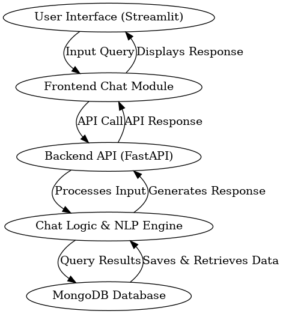

# LLM-Powered Procurement Chatbot

## Overview

The **LLM-Powered Procurement Chatbot (BuyBot)** is an AI-based procurement assistant designed to enhance user experience by generating accurate, context-aware, and user-friendly responses to procurement-related queries. The project tackles challenges such as data complexity and user satisfaction to deliver significant business value through optimized procurement processes.

---

## Demo

[Chatbot UI](https://drive.google.com/file/d/1Bdt5IwgrxygklByiOcchDbMcpn31pg9x/view?usp=sharing)

---

## Installation

To run the app locally, install the required dependencies using the following command:

```bash
pip install -r requirements.txt
```

---

## Run the App

You can run the chatbot application by following the instructions provided in the [Run Chatbot Guide](https://github.com/AfafSaedabdlrahman/procurement-Chatbot/blob/main/app/readme.md).

---

## Project Contents

- **[Dataset Details](https://github.com/AfafSaedabdlrahman/procurement-Chatbot/tree/main/DataSet):** Detailed profiling of the dataset is available in the `insights/` directory.
- **EDA and Model Development:** Located in the `app/` directory.

---

## Pipeline Overview



### Problem Definition

#### Context

The project focuses on improving the performance of the **BuyBot** AI assistant by addressing key challenges in processing and interpreting procurement data to provide actionable insights.

#### Impact of the Problem

- **Data Complexity:** Procurement datasets are often large, noisy, and inconsistent.
- **User Experience:** Poorly structured or inaccurate responses decrease user trust.
- **Business Value:** Optimized responses improve procurement efficiency and reduce costs.

---

## Experimental Protocol Applied

### 1. Initial Approach: Data Preprocessing

- **Handling Missing Values:** Replaced or filled missing values with defaults where necessary.
- **Standardizing Formats:** Ensured consistent data formats (e.g., dates, categories).
- **Dropping Irrelevant Columns:** Removed columns that did not meaningfully contribute to answering queries.

**Observation:** Structured preprocessing improved dataset clarity but had limited impact on response quality.

---

### 2. Refining the Approach: Customizing the Prompt

- **Dataset Context Generation:** Summarized dataset structure (e.g., rows, columns, unique values) and included sample data to guide the model.

**Observation:** Clearer dataset context led to more accurate and relevant model responses.

---

### 3. Enhancing Readability: Formatting Responses

- **Improved Readability:** Raw outputs were processed to make them more structured and user-friendly.
  - Implemented functions to process responses into concise, well-organized formats.

**Result:** Significantly improved clarity and usability of AI responses.

---

## Challenges and Solutions

| Challenge                 | Solution                              | Result                                 |
|---------------------------|---------------------------------------|----------------------------------------|
| **Data Complexity**       | Preprocessed data for consistency    | Improved data clarity                 |
| **Prompt Guidance**       | Customized prompts with dataset info | Enhanced response accuracy            |
| **Response Readability**  | Structured and formatted responses   | Improved user trust and experience    |

---

## Final Approach

### 1. Data Preprocessing

- Addressed missing values, standardized formats, and removed irrelevant columns to optimize the dataset.

### 2. Customized Prompts

- Generated detailed and structured dataset context to provide clear guidance for the AI model.

### 3. Improved Response Formatting

- Developed a function to process and structure responses for better readability.

**Outcome:** A significant improvement in the assistant's accuracy, relevance, and user-friendliness.

---

## Conclusion

The **BuyBot** AI assistant achieved a notable enhancement in performance through:

- **Effective Data Preprocessing**: Optimized dataset quality for improved processing.
- **Custom Prompt Engineering**: Provided clear dataset context for accurate responses.
- **Enhanced Response Readability**: Delivered well-structured outputs for an improved user experience.

These efforts resulted in an AI assistant that is more reliable, efficient, and capable of meeting business and user needs.
